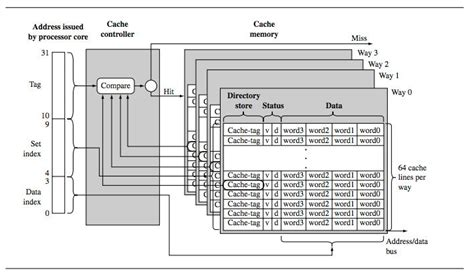

  

<h3 align="center">Set Associative Cache</h3>

   
  
  

---

 A modular and customizable set associative cache.  
  Developed to be implemented into my 32 bit risc v core. This implementation of set associative will use a relative LRU algorithm.  Metadata is kept simple, with single bits: VALID, DIRTY, LRU (excluding tag).  Cache parameters can be manimpulated for custom caches. 
      

  

 Things to do.  
  I need to add a tagging mechanism
      

